# 🏗️ Arquitetura do Sistema TSiJUKEBOX

<p align="center">
  
</p>

<p align="center">
  <strong>Documentação Técnica da Arquitetura</strong>
  <br>
  Versão 4.0.0
</p>

---

## 📋 Índice

- [Visão Geral](#visão-geral)
- [Arquitetura de Alto Nível](#arquitetura-de-alto-nível)
- [Fluxo de Dados](#fluxo-de-dados)
- [Estrutura de Componentes](#estrutura-de-componentes)
- [Modelo de Dados](#modelo-de-dados)
- [Organização de Hooks](#organização-de-hooks)
- [Fluxo de Autenticação](#fluxo-de-autenticação)
- [Integrações Externas](#integrações-externas)
- [Estrutura de Diretórios](#estrutura-de-diretórios)

---

## Visão Geral

TSiJUKEBOX é uma Progressive Web Application (PWA) enterprise para sistemas de música em modo kiosk. A arquitetura segue os princípios de:

- **Separação de Responsabilidades**: UI, lógica de negócio e dados claramente separados
- **Componentização**: Componentes reutilizáveis e independentes
- **Type Safety**: TypeScript em todo o codebase
- **Acessibilidade**: WCAG 2.1 AA compliance
- **Offline-First**: PWA com suporte offline

---

## Arquitetura de Alto Nível

```mermaid
graph TB
    subgraph "🖥️ Frontend - React + Vite"
        UI["🎨 UI Components<br/>(shadcn/ui + Tailwind)"]
        Pages["📄 32 Pages<br/>(React Router)"]
        Hooks["🪝 Custom Hooks<br/>(6 domínios)"]
        Contexts["🔄 Context Providers<br/>(5 providers)"]
        ReactQuery["⚡ React Query<br/>(Cache + State)"]
    end
    
    subgraph "☁️ Backend - Lovable Cloud"
        Auth["🔐 Authentication<br/>(Email + OAuth)"]
        DB[("🗄️ Database<br/>(PostgreSQL)")]
        Edge["⚡ Edge Functions<br/>(4 endpoints)"]
        Storage["📁 File Storage<br/>(Buckets)"]
    end
    
    subgraph "🌐 External Services"
        Spotify["🎵 Spotify API"]
        YouTube["📺 YouTube Music API"]
        Storj["☁️ Storj Cloud"]
        Weather["🌤️ Weather API"]
        Spicetify["🎨 Spicetify CLI"]
    end
    
    UI --> Hooks
    Pages --> Hooks
    Hooks --> Contexts
    Hooks --> ReactQuery
    ReactQuery --> Edge
    ReactQuery --> DB
    Edge --> Spotify
    Edge --> YouTube
    Contexts --> Auth
    Storage --> Storj
```

---

## Fluxo de Dados

```mermaid
flowchart LR
    subgraph "👤 User Layer"
        User["👤 User"]
    end
    
    subgraph "🎨 Presentation Layer"
        UI["UI Components"]
        Pages["Pages"]
    end
    
    subgraph "🧠 Logic Layer"
        Hooks["Custom Hooks"]
        Contexts["Contexts"]
    end
    
    subgraph "📡 Data Layer"
        RQ["React Query"]
        Cache["Local Cache"]
    end
    
    subgraph "☁️ Backend Layer"
        Edge["Edge Functions"]
        DB[("Database")]
        ExtAPI["External APIs"]
    end
    
    User --> UI
    UI --> Hooks
    Pages --> Hooks
    Hooks --> Contexts
    Hooks --> RQ
    RQ --> Cache
    RQ --> Edge
    Edge --> DB
    Edge --> ExtAPI
    
    Cache -.-> |"Hydrate"| UI
    DB -.-> |"Response"| RQ
    ExtAPI -.-> |"Response"| Edge
```

---

## Estrutura de Componentes

```mermaid
graph TD
    subgraph "🔝 App Root"
        App["App.tsx"]
    end
    
    subgraph "🔄 Providers"
        QCP["QueryClientProvider"]
        SP["SettingsProvider"]
        UP["UserProvider"]
        TP["TooltipProvider"]
        THP["ThemeProvider"]
    end
    
    subgraph "🛣️ Routing"
        BR["BrowserRouter"]
        Routes["Routes"]
    end
    
    subgraph "📄 Page Types"
        Public["Public Pages<br/>(Login, Help, Wiki)"]
        Protected["Protected Pages<br/>(Dashboard, Settings)"]
        Admin["Admin Pages<br/>(Admin, Logs, Library)"]
    end
    
    subgraph "🧩 Component Categories"
        Player["Player Components<br/>(12 components)"]
        Settings["Settings Components<br/>(28 components)"]
        Auth["Auth Components<br/>(6 components)"]
        UILib["UI Library<br/>(50+ shadcn)"]
        Spotify["Spotify Components<br/>(8 components)"]
        YouTube["YouTube Components<br/>(5 components)"]
    end
    
    App --> QCP
    QCP --> SP
    SP --> UP
    UP --> TP
    TP --> THP
    THP --> BR
    BR --> Routes
    Routes --> Public
    Routes --> Protected
    Routes --> Admin
    
    Protected --> Player
    Protected --> Settings
    Public --> Auth
    Player --> UILib
    Settings --> UILib
```

---

## Modelo de Dados

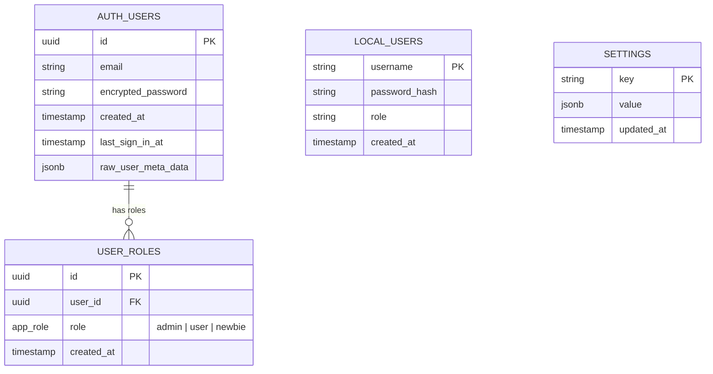

### Tipos de Role

| Role | Descrição | Permissões |
|------|-----------|------------|
| `admin` | Administrador | Acesso total ao sistema |
| `user` | Usuário padrão | Controle de reprodução, playlists |
| `newbie` | Novo usuário | Acesso limitado, apenas visualização |

---

## Organização de Hooks

```mermaid
mindmap
  root((🪝 Hooks))
    🎵 Player
      usePlayer
      usePlaybackControls
      useVolume
      useLyrics
      useLibrary
      useLocalMusic
      useSpicetifyIntegration
    🎧 Spotify
      useSpotifyPlayer
      useSpotifySearch
      useSpotifyLibrary
      useSpotifyPlaylists
      useSpotifyBrowse
      useSpotifyRecommendations
    📺 YouTube
      useYouTubeMusicPlayer
      useYouTubeMusicSearch
      useYouTubeMusicLibrary
    ⚙️ System
      useConnectionMonitor
      useWeather
      useWeatherForecast
      useStorjClient
      useWebSocketStatus
      useNetworkStatus
      useLogs
      useStatus
      useContrastDebug
    🔧 Common
      useTranslation
      useDebounce
      useTouchGestures
      useFirstAccess
      useGlobalSearch
      useMediaProviderStorage
      usePWAInstall
      useRipple
      useSoundEffects
      useThemeCustomizer
    🔐 Auth
      useAuthConfig
      useLocalAuth
      useSupabaseAuth
```

### Padrão de Importação

```typescript
// ✅ Recomendado: Import do barrel principal
import { usePlayer, useTranslation, useSpotifySearch } from '@/hooks';

// ✅ Alternativo: Import por categoria
import { usePlayer, useVolume } from '@/hooks/player';

// ❌ Evitar: Import direto do arquivo
import { usePlayer } from '@/hooks/player/usePlayer';
```

---

## Fluxo de Autenticação

```mermaid
sequenceDiagram
    participant U as 👤 User
    participant F as 🖥️ Frontend
    participant A as 🔐 Auth Service
    participant DB as 🗄️ Database
    participant R as 🛡️ RLS Policies
    
    rect rgb(240, 248, 255)
        Note over U,R: Login Flow
        U->>F: 1. Enter credentials
        F->>A: 2. signInWithPassword()
        A->>A: 3. Validate credentials
        A->>DB: 4. get_user_role(user_id)
        DB-->>A: 5. Return role
        A-->>F: 6. Session + JWT
        F->>F: 7. Store session
        F-->>U: 8. Redirect to Dashboard
    end
    
    rect rgb(255, 248, 240)
        Note over U,R: Protected Request
        U->>F: 9. Access protected resource
        F->>A: 10. Request with JWT
        A->>R: 11. Check RLS policies
        R->>DB: 12. has_role() check
        DB-->>R: 13. Allow/Deny
        R-->>F: 14. Data or 403
        F-->>U: 15. Display result
    end
```

### Modos de Autenticação

```mermaid
graph LR
    subgraph "🔐 Auth Modes"
        Local["Local Auth<br/>(localStorage)"]
        Supabase["Supabase Auth<br/>(JWT + RLS)"]
    end
    
    subgraph "📋 Configuration"
        Config["useAuthConfig()"]
    end
    
    subgraph "🎯 Providers"
        Email["Email/Password"]
        OAuth["OAuth Providers"]
    end
    
    Config --> Local
    Config --> Supabase
    Supabase --> Email
    Supabase --> OAuth
```

---

## Integrações Externas

```mermaid
graph TB
    subgraph "🎵 Music Providers"
        SP["Spotify"]
        YT["YouTube Music"]
        LM["Local Music"]
    end
    
    subgraph "⚡ Edge Functions"
        SA["spotify-auth"]
        YA["youtube-music-auth"]
        LS["lyrics-search"]
        GH["github-repo"]
    end
    
    subgraph "☁️ Cloud Services"
        Storj["Storj<br/>(Backup)"]
        Weather["Weather API<br/>(Widget)"]
    end
    
    subgraph "🔧 Local Tools"
        Spicetify["Spicetify CLI"]
        SSH["SSH Sync"]
    end
    
    SP --> SA
    YT --> YA
    SA --> |"OAuth 2.0"| SP
    YA --> |"OAuth 2.0"| YT
    
    LM --> Spicetify
    LM --> SSH
    
    Storj --> |"S3 Compatible"| SA
```

### Edge Functions

| Função | Endpoint | Descrição |
|--------|----------|-----------|
| `spotify-auth` | `/functions/v1/spotify-auth` | OAuth flow do Spotify |
| `youtube-music-auth` | `/functions/v1/youtube-music-auth` | OAuth flow do YouTube Music |
| `lyrics-search` | `/functions/v1/lyrics-search` | Busca de letras sincronizadas |
| `github-repo` | `/functions/v1/github-repo` | Integração com GitHub |

---

## Estrutura de Diretórios

```
TSiJUKEBOX/
├── 📁 src/
│   ├── 📁 components/          # Componentes React
│   │   ├── 📁 auth/            # Autenticação (6)
│   │   ├── 📁 player/          # Player de música (12)
│   │   ├── 📁 settings/        # Configurações (28)
│   │   ├── 📁 spotify/         # Spotify (8)
│   │   ├── 📁 youtube/         # YouTube (5)
│   │   ├── 📁 ui/              # shadcn/ui (50+)
│   │   └── 📁 ...              # Outros
│   │
│   ├── 📁 contexts/            # React Contexts (5)
│   │   ├── AppSettingsContext.tsx
│   │   ├── SettingsContext.tsx
│   │   ├── SpotifyContext.tsx
│   │   ├── ThemeContext.tsx
│   │   ├── UserContext.tsx
│   │   └── YouTubeMusicContext.tsx
│   │
│   ├── 📁 hooks/               # Custom Hooks
│   │   ├── 📁 auth/            # Auth hooks (3)
│   │   ├── 📁 common/          # Hooks comuns (18)
│   │   ├── 📁 pages/           # Page-specific (1)
│   │   ├── 📁 player/          # Player hooks (7)
│   │   ├── 📁 spotify/         # Spotify hooks (6)
│   │   ├── 📁 system/          # System hooks (12)
│   │   └── 📁 youtube/         # YouTube hooks (3)
│   │
│   ├── 📁 pages/               # 32 Pages
│   ├── 📁 lib/                 # Utilitários
│   ├── 📁 types/               # TypeScript types
│   ├── 📁 i18n/                # Internacionalização
│   └── 📁 integrations/        # Supabase client
│
├── 📁 supabase/
│   ├── 📁 functions/           # Edge Functions (4)
│   └── config.toml             # Supabase config
│
├── 📁 docs/                    # Documentação
├── 📁 e2e/                     # Testes E2E
├── 📁 scripts/                 # Scripts de automação
└── 📁 packaging/               # Pacotes de distribuição
    └── 📁 arch/                # Arch Linux PKGBUILD
```

---

## Stack Tecnológico

```mermaid
graph LR
    subgraph "🎨 Frontend"
        React["React 18.3"]
        TS["TypeScript 5"]
        Vite["Vite"]
        TW["Tailwind CSS"]
        Shadcn["shadcn/ui"]
        FM["Framer Motion"]
    end
    
    subgraph "📡 State & Data"
        RQ["React Query"]
        RHF["React Hook Form"]
        Zod["Zod"]
    end
    
    subgraph "☁️ Backend"
        Supa["Lovable Cloud"]
        PG["PostgreSQL"]
        Edge["Edge Functions"]
    end
    
    subgraph "🧪 Testing"
        Vitest["Vitest"]
        PW["Playwright"]
        RTL["Testing Library"]
    end
    
    React --> RQ
    RQ --> Supa
    Supa --> PG
    Supa --> Edge
```

---

## Performance & Otimizações

### Lazy Loading

```mermaid
graph TD
    App["App.tsx"]
    
    subgraph "📦 Code Splitting"
        Admin["Admin Pages<br/>(lazy)"]
        Settings["Settings<br/>(lazy)"]
        Spotify["Spotify Browser<br/>(lazy)"]
        YouTube["YouTube Browser<br/>(lazy)"]
    end
    
    subgraph "⚡ Eager Load"
        Index["Index Page"]
        Login["Login Page"]
        Help["Help Page"]
    end
    
    App --> Index
    App --> Login
    App --> Help
    App -.-> |"lazy()"| Admin
    App -.-> |"lazy()"| Settings
    App -.-> |"lazy()"| Spotify
    App -.-> |"lazy()"| YouTube
```

### Caching Strategy

| Camada | TTL | Estratégia |
|--------|-----|------------|
| React Query | 5 min | staleWhileRevalidate |
| Service Worker | 24h | Cache First |
| localStorage | Permanente | User preferences |
| sessionStorage | Session | Temp state |

---

## Segurança

```mermaid
graph TB
    subgraph "🛡️ Security Layers"
        RLS["Row Level Security"]
        JWT["JWT Tokens"]
        RBAC["Role-Based Access"]
        Secrets["Encrypted Secrets"]
    end
    
    subgraph "🔐 Auth Flow"
        Login["Login"]
        Validate["Validate"]
        Authorize["Authorize"]
    end
    
    subgraph "📋 Policies"
        Admin["Admin Policy"]
        User["User Policy"]
        Public["Public Policy"]
    end
    
    Login --> JWT
    JWT --> Validate
    Validate --> RBAC
    RBAC --> RLS
    RLS --> Admin
    RLS --> User
    RLS --> Public
```

---

## Próximos Passos

- [ ] Implementar WebSocket para real-time updates
- [ ] Adicionar suporte a múltiplos idiomas (i18n completo)
- [ ] Implementar modo offline com IndexedDB
- [ ] Adicionar testes de integração para Edge Functions
- [ ] Implementar CI/CD pipeline completo

---

<p align="center">
  <strong>TSiJUKEBOX Enterprise</strong> — Arquitetura Escalável
  <br>
  Última atualização: Dezembro 2025
</p>
