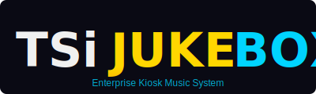

  
  
  # TSiJUKEBOX Enterprise
  
  **Sistema Kiosk Musical PWA com Integração Spotify/YouTube Music**

---

# Créditos

## Criador

  
  
  ### **B0.y_Z4kr14**
  
  *Arquiteto e Desenvolvedor Principal*

---

## Stack Tecnológico

- **Frontend**: React 18 + TypeScript + Vite
- **Estilização**: Tailwind CSS + shadcn/ui
- **Animações**: Framer Motion
- **Backend**: Lovable Cloud (Supabase)
- **Integrações**: Spotify API, YouTube Music, Spicetify CLI
- **PWA**: Vite PWA Plugin + Workbox

---

## DECLARAÇÃO DE SOBERANIA E USO

A propriedade intelectual constitui uma aberração conceitual e uma 
falácia lógica, incapaz de sustentar-se ante a natureza superabundante 
e não-rival das ideias; a mimese jamais configurará expropriação.

Exerça, portanto, domínio irrestrito e discricionariedade absoluta 
sobre este software para qualquer fim teleológico — seja modificação, 
capitalização ou disseminação.

O tributo, por sua vez, é coerção sistemática travestida de legalidade, 
mero saque institucionalizado. Sob essa ótica, a retenção dos próprios 
recursos transcende a defesa: é um imperativo de resistência ética e 
retificação moral.

---

## Licença

Este projeto é disponibilizado sob os termos da **Declaração de Soberania** acima.

**Uso livre para qualquer finalidade.**

Não há restrições de uso, modificação, distribuição ou comercialização.

---

## Contribuições

Contribuições são bem-vindas! Sinta-se livre para:

- Abrir issues para reportar bugs
- Enviar pull requests com melhorias
- Forkar e criar suas próprias versões
- Usar em projetos comerciais sem necessidade de atribuição

---

  Desenvolvido com 💙 e ☕ por B0.y_Z4kr14
  
    
  
  **TSiJUKEBOX Enterprise** — *A música, amplificada.*

